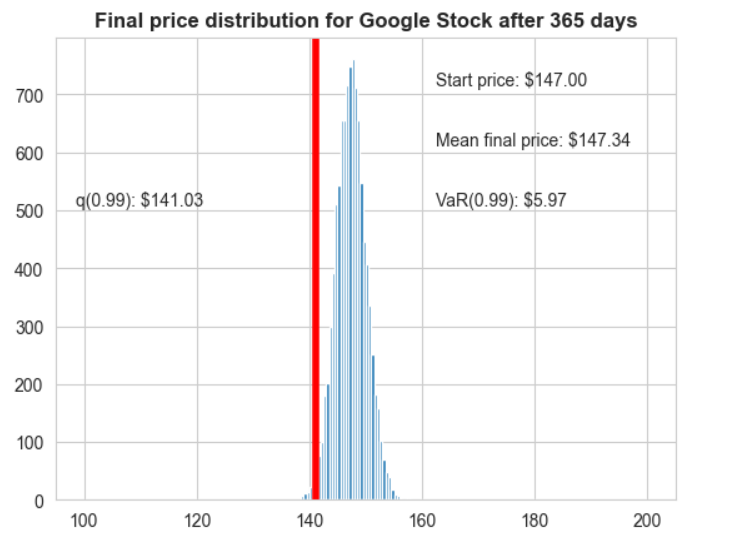

# Risk Analysis for FAANG Stocks 📈  

## Overview  
This project simulates future stock prices of FAANG (Facebook, Apple, Amazon, Netflix, Google) stocks using the **Monte Carlo method**. By leveraging historical stock data, we estimate future price distributions and calculate key risk metrics, such as **Value at Risk (VaR)** at a 99% confidence level.  

## Features  
- **Stock Price Simulation**: Uses Monte Carlo methods to model stock price movements.  
- **Risk Assessment**: Calculates Value at Risk (VaR) to estimate potential losses.  
- **Visualization**: Generates histograms to visualize the probability distribution of stock prices.  
- **Multiple FAANG Stocks**: Simulations can be run for any of the FAANG stocks.  

## Methodology  
1. **Data Collection**: Historical stock price data is retrieved.  
2. **Monte Carlo Simulation**:  
   - Computes **daily returns** and estimates **mean (\(\mu\)) and volatility (\(\sigma\))**.  
   - Simulates **10,000+ possible future stock price paths**.  
   - Generates a **final price distribution** after 365 days.  
3. **Risk Calculation**:  
   - Determines the **1st percentile (q99) price level**.  
   - Computes **VaR(0.99)** as the difference between the starting price and q99.  

## Example Output  
The following is an example **final price distribution** for Google stock after 365 days:  

  

### Key Observations  
- **Stability**: The stock price remains relatively stable, with a **small mean difference of $0.29**.  
- **Risk Analysis**: The **VaR at 99% confidence is $5.92**, indicating a **low probability of extreme losses**.  
- **Investment Insight**: Based on the simulation, Google appears to be a **low-risk investment** with a high probability of maintaining its value.  

## Future Improvements  
- Expand to **non-FAANG** stocks.  
- Add **real-time stock data fetching** via APIs.  

